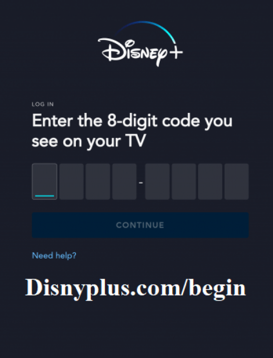

# disneyplus.com/begin

Get ready to relish new wonders of **Disney, Pixar, Marvel, Star Wars, National Geographic and Star** content on your most lovable platform - [**disneyplus.com/begin**](), with its subscription. You can access all your favorite TV Shows & Movies on it , even it comes with download feature to allow its users. Here, we present you with some of the important stages required to access[**disneyplus.com/begin**]() content.

## Activate disneyplus.com/begin account on TV

Below are some steps to login [**disneyplus.com/begin**]()  account on TV:-
1. Launch Disney Plus app.
2. Tap **login**.
3. A 8-digit code will appear on your TV’s screen.
4. Then type [**disneyplus.com/begin**]() on your device's browser.
5. Enter allyour login info.
6. And write the 8-digit code.
7. Further, **'Continue'**.

## Way to disneyplus.com/begin And Login

One important condition is that user must be a  [**disneyplus.com/begin**]() subscriber.

1. Tap Login on the website's main page.
2. Now, enter email  login info 
3. Enter OTP , notified on the email.
4. Further, type Username **>**  Sign in

 

## Get access to disneyplus.com/begin on Android TV
1. Fire up your Android TV**>** Go to play store.
2. Search"Disney Plus app" for [**disneyplus.com/begin**]() > Download and install it.  
3. Under app command center , open Disney Plus app.
4. An activation code will appear.
5. Turn your phone on **>** Search **disneyplus.com/begin** on browser.
6. Enter all login credentials **>** also enter activation code from TV.
7. Click **"activate device"**
8. Now get ready to watch endless TV Shows and movies.
